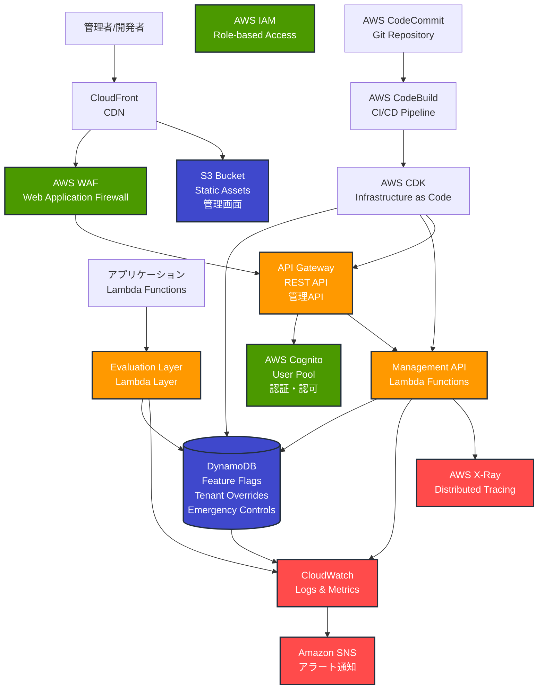
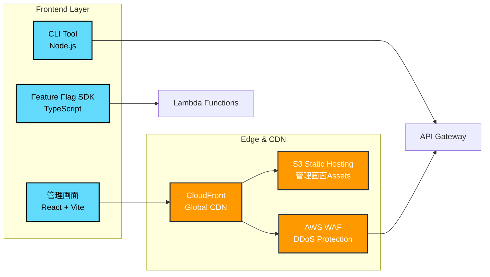
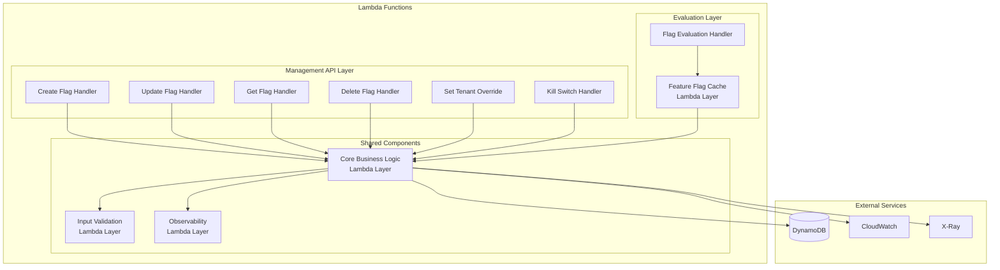
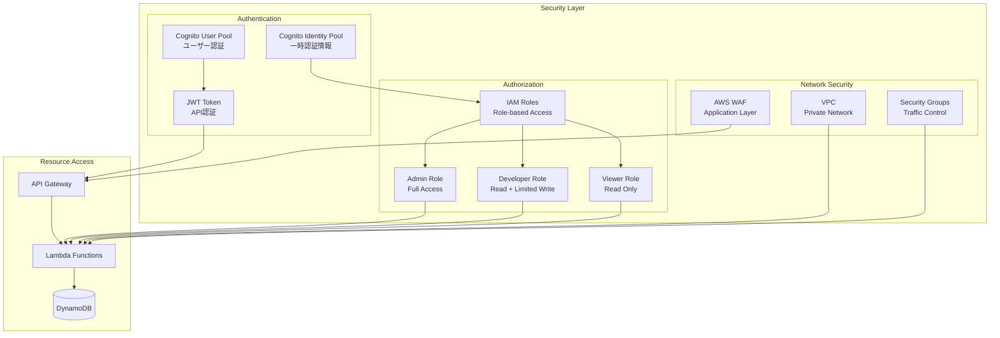
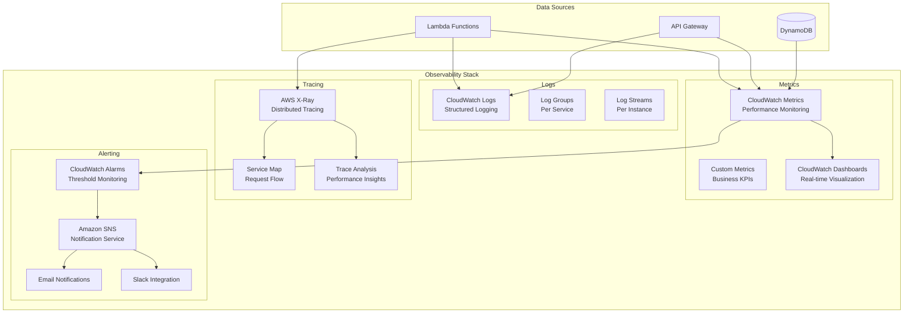
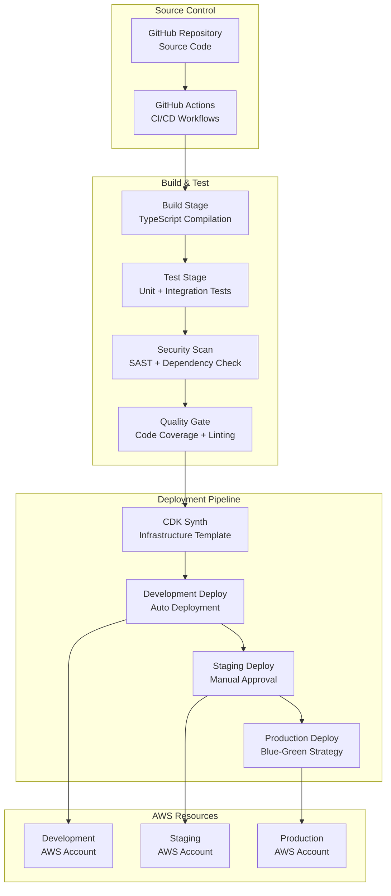
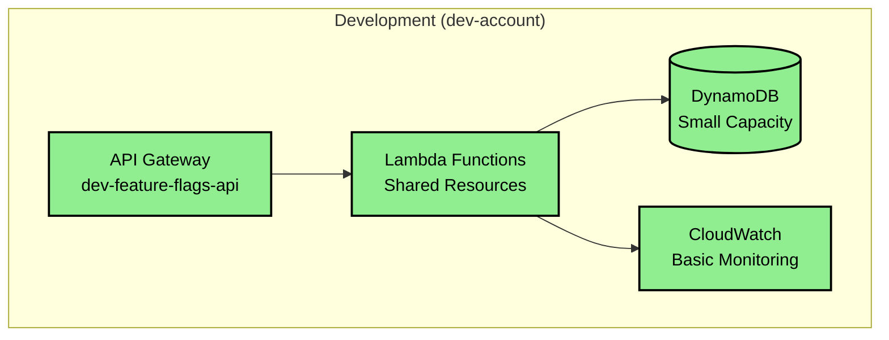
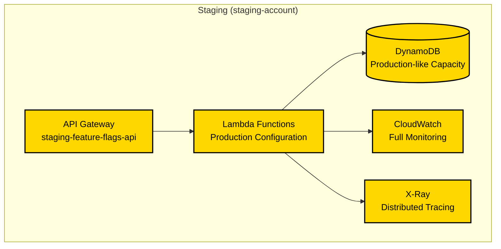
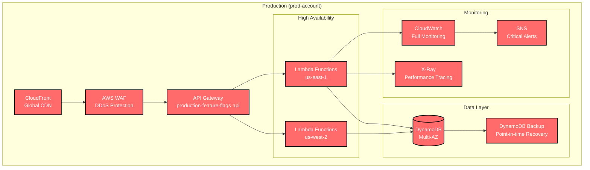

# AWSシステム構成図 - フィーチャーフラグシステム

## 全体アーキテクチャ概要



## 詳細コンポーネント構成

### 1. フロントエンド層



### 2. API Gateway 構成

```mermaid
graph TB
    subgraph "API Gateway"
        APIGW[REST API Gateway]
        
        subgraph "Resources"
            FlagsResource[/flags]
            TenantsResource[/flags/{flagKey}/tenants]
            EmergencyResource[/emergency/kill-switch]
            HealthResource[/health]
        end
        
        subgraph "Security"
            Authorizer[Cognito Authorizer]
            ThrottlingPolicy[Throttling Policy<br/>1000 req/sec]
            CORS[CORS Configuration]
        end
    end
    
    subgraph "Backend Integration"
        ManagementLambda[Management Lambda<br/>CRUD Operations]
        EvaluationLambda[Evaluation Lambda<br/>Flag Resolution]
    end
    
    APIGW --> FlagsResource
    APIGW --> TenantsResource
    APIGW --> EmergencyResource
    APIGW --> HealthResource
    
    FlagsResource --> ManagementLambda
    TenantsResource --> ManagementLambda
    EmergencyResource --> ManagementLambda
    HealthResource --> EvaluationLambda
    
    APIGW --> Authorizer
    APIGW --> ThrottlingPolicy
    APIGW --> CORS
```

### 3. Lambda アーキテクチャ



### 4. DynamoDB テーブル設計

```mermaid
erDiagram
    FeatureFlags {
        string PK "FLAG#flagKey"
        string SK "METADATA" 
        string flagKey
        string description
        boolean defaultEnabled
        string owner
        datetime createdAt
        datetime expiresAt
        string GSI1PK "EXPIRES"
        datetime GSI1SK "expiresAt"
    }
    
    TenantOverrides {
        string PK "TENANT#tenantId"
        string SK "FLAG#flagKey"
        boolean enabled
        datetime updatedAt
        string updatedBy
        string GSI1PK "FLAG#flagKey"
        string GSI1SK "TENANT#tenantId"
    }
    
    EmergencyControls {
        string PK "EMERGENCY"
        string SK "GLOBAL | FLAG#flagKey"
        boolean enabled
        string reason
        datetime activatedAt
        string activatedBy
    }
    
    AuditLogs {
        string PK "AUDIT#YYYY-MM-DD"
        string SK "timestamp#requestId"
        string action
        string resource
        string userId
        object oldValue
        object newValue
        datetime timestamp
    }
    
    FeatureFlags ||--o{ TenantOverrides : "has overrides"
    FeatureFlags ||--o{ EmergencyControls : "has kill switches"
    FeatureFlags ||--o{ AuditLogs : "generates audit trail"
```

### 5. セキュリティ & 認証



### 6. 監視 & ログ



### 7. CI/CD パイプライン



## 環境別構成

### Development Environment



### Staging Environment



### Production Environment



## コスト最適化戦略

### Lambda 最適化

- **Provisioned Concurrency**: 高頻度APIのみ適用
- **Memory Optimization**: 実測値に基づく最適化
- **Layer Strategy**: 共通ライブラリの効率的共有

### DynamoDB 最適化

- **On-Demand**: 開発・ステージング環境
- **Provisioned**: 本番環境（予測可能な負荷）
- **Auto Scaling**: トラフィック変動への自動対応

### 監視コスト最適化

- **Log Retention**: 環境別の適切な保持期間設定
- **Metric Filtering**: 重要メトリクスのみ長期保存
- **Alarm Optimization**: 適切な閾値設定でノイズ削減

## セキュリティ考慮事項

### データ保護

- **Encryption at Rest**: DynamoDB暗号化
- **Encryption in Transit**: TLS 1.2+
- **Key Management**: AWS KMS統合

### アクセス制御

- **Principle of Least Privilege**: 最小権限の原則
- **Role Separation**: 環境別IAMロール分離
- **MFA Enforcement**: 管理者アクセスでのMFA必須

### 監査・コンプライアンス

- **CloudTrail**: API呼び出しの完全ログ
- **Config Rules**: リソース設定の継続監視
- **GuardDuty**: 異常検知とセキュリティ監視

この構成図は、スケーラビリティ、可用性、セキュリティ、コスト効率性を考慮したエンタープライズグレードのフィーチャーフラグシステムを表現しています。