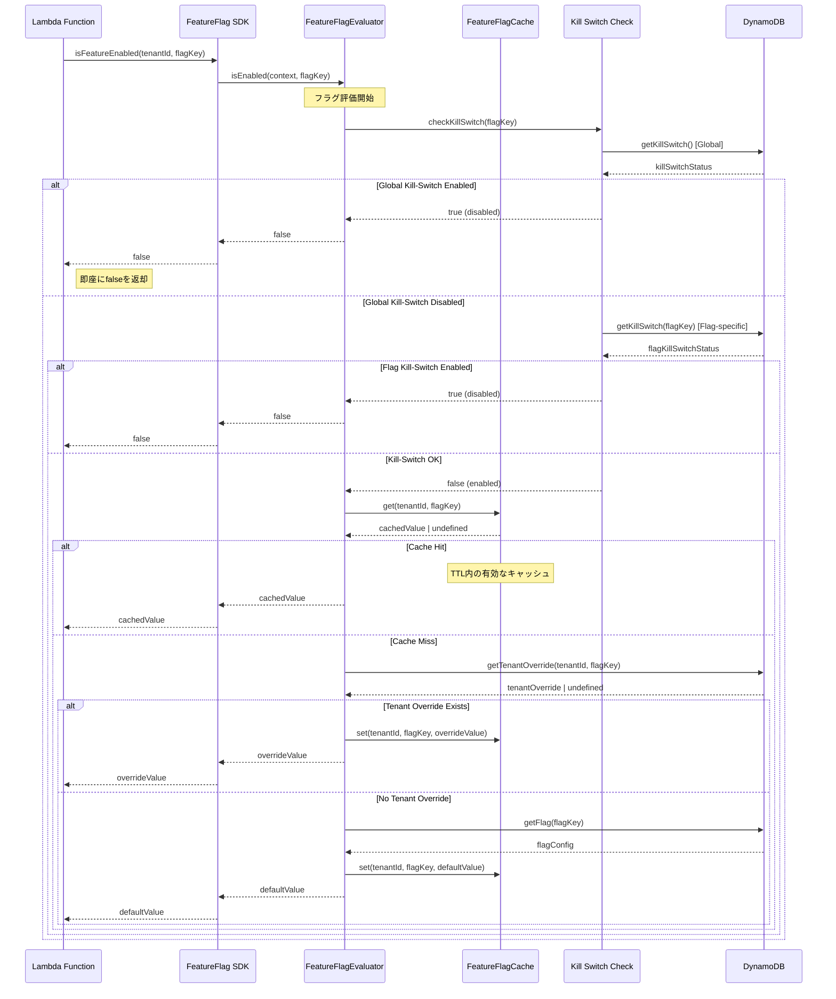
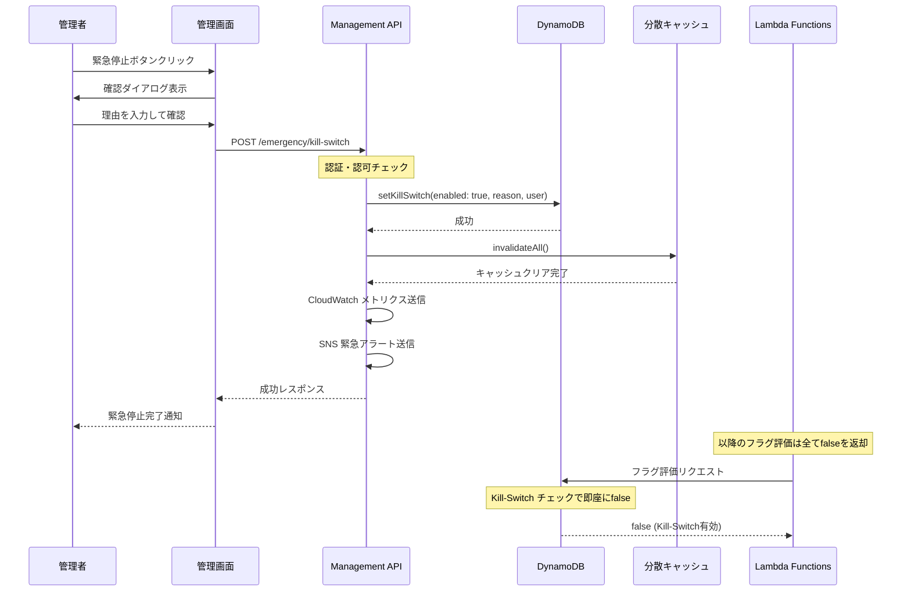
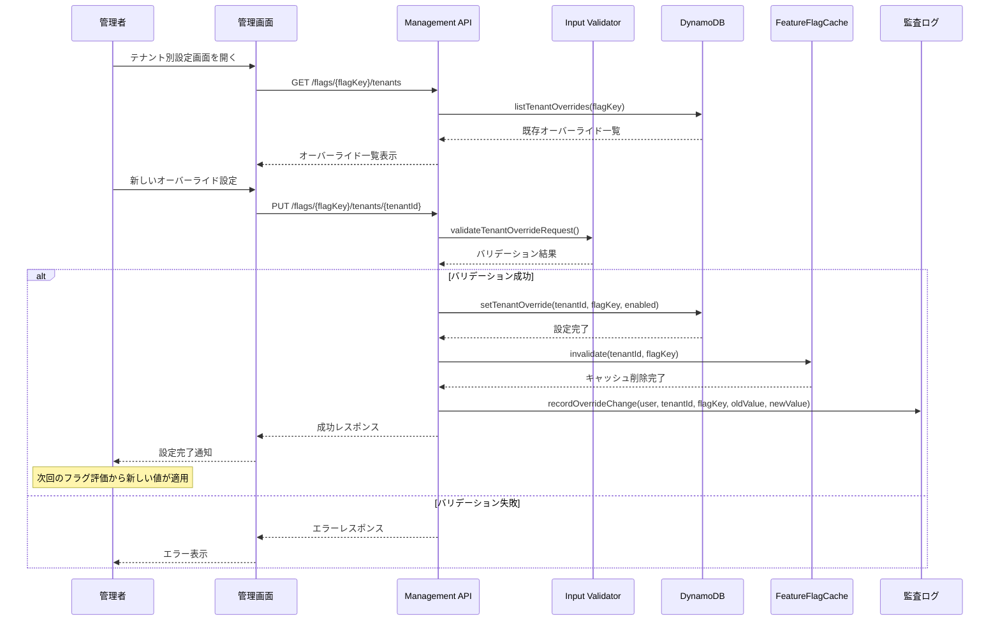
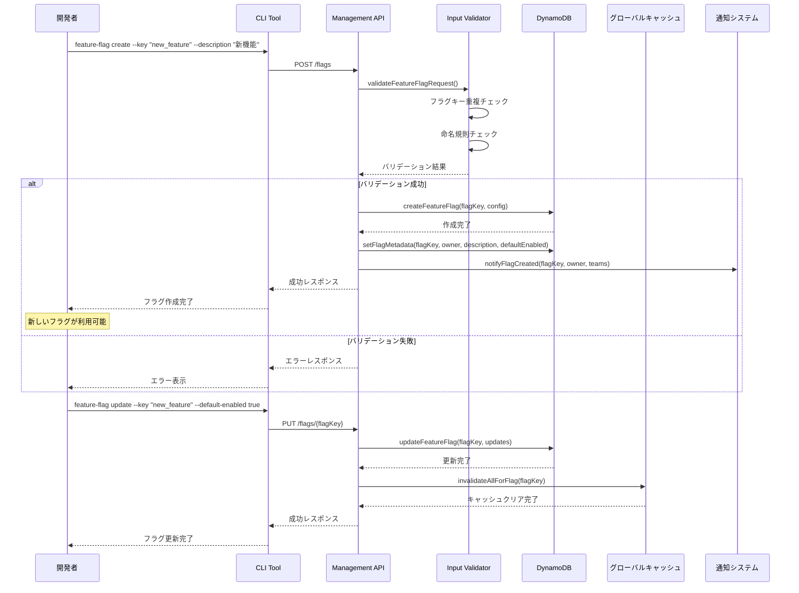
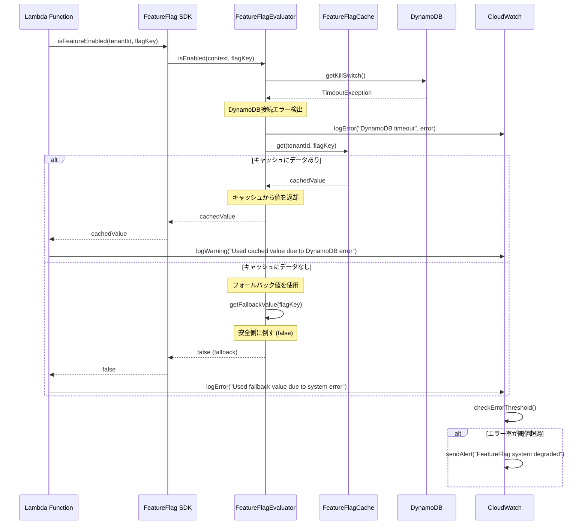
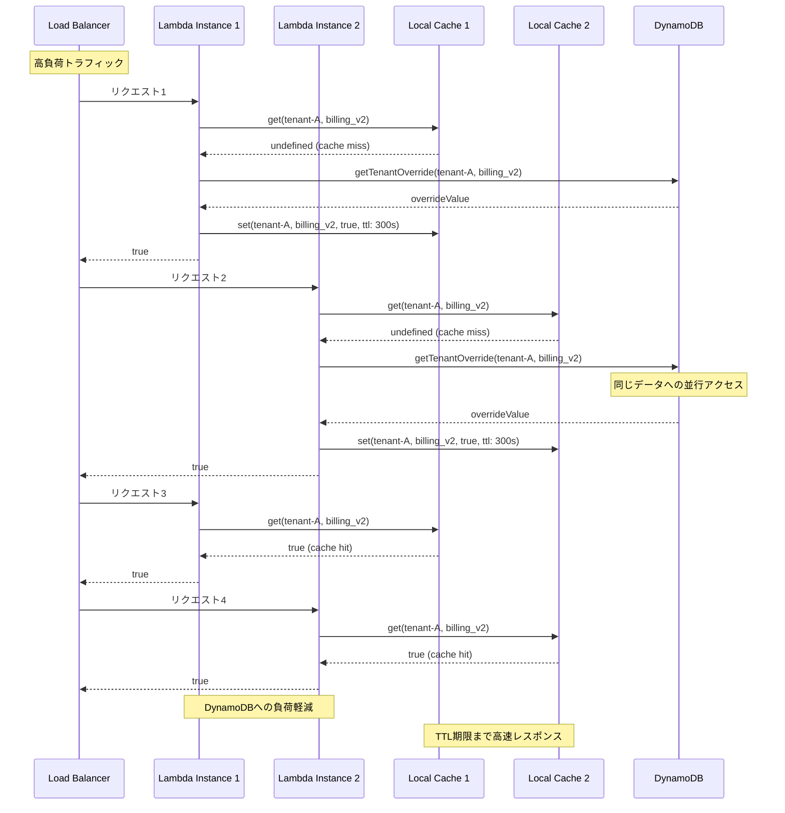

# フィーチャーフラグシステム - シーケンス図

> **注意**: このドキュメントは技術的な詳細を含んでいます。一部の参照リンクは準備中です。

## 1. フラグ評価フロー（基本）



## 2. Kill-Switch 緊急停止フロー



## 3. テナント別オーバーライド設定フロー



## 4. フラグ作成・更新フロー



## 5. エラーハンドリング・フォールバックフロー



## 6. 高負荷時のキャッシュ戦略



## 7. 監査ログ・トレーサビリティフロー

```mermaid
sequenceDiagram
    participant User as ユーザー
    participant API as Management API
    participant Auth as 認証システム
    participant DynamoDB as DynamoDB
    participant Streams as DynamoDB Streams
    participant AuditLog as 監査ログ
    participant CloudWatch as CloudWatch

    User->>API: フラグ設定変更リクエスト
    API->>Auth: validateUser(token)
    Auth-->>API: userInfo
    
    API->>DynamoDB: updateFeatureFlag(flagKey, changes)
    Note over DynamoDB: 変更をコミット
    
    %% DynamoDB Streamsによる変更検出
    DynamoDB->>Streams: 変更イベント発火
    Streams->>AuditLog: processChangeEvent(oldValue, newValue, timestamp)
    
    AuditLog->>AuditLog: createAuditRecord(
        action: "UPDATE_FLAG",
        user: userInfo,
        resource: flagKey,
        oldValue: oldValue,
        newValue: newValue,
        timestamp: timestamp,
        requestId: requestId
    )
    
    %% 監査ログをCloudWatchへ送信
    AuditLog->>CloudWatch: putLogEvent(auditRecord)
    
    %% 重要な変更の場合はアラート
    alt 本番環境での変更
        AuditLog->>CloudWatch: putMetric("ProductionFlagChange")
        CloudWatch->>CloudWatch: triggerAlert("Production flag modified")
    end
    
    API-->>User: 変更完了レスポンス
    
    Note over CloudWatch: 変更履歴は完全に追跡可能
    Note over AuditLog: 規制遵守・セキュリティ監査対応
```

## まとめ

これらのシーケンス図は以下の重要な要素をカバーしています：

1. **基本フロー**: 通常のフラグ評価処理
2. **緊急時対応**: Kill-Switch による即座の機能停止
3. **運用管理**: テナント別設定とフラグ管理
4. **障害対応**: エラー時のフォールバック戦略
5. **性能最適化**: キャッシュ戦略と負荷分散
6. **ガバナンス**: 監査ログとトレーサビリティ

各フローは実際の実装と整合性を保ち、運用時の様々なシナリオに対応できる設計となっています。