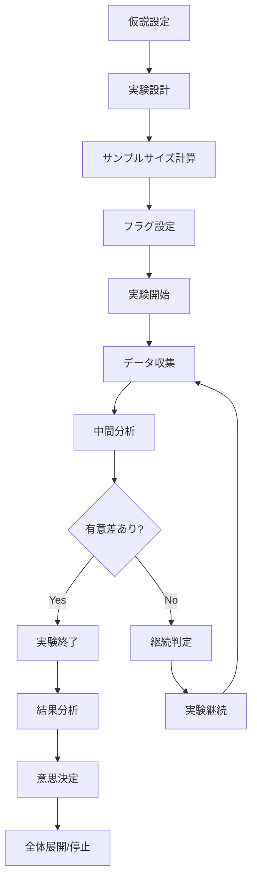
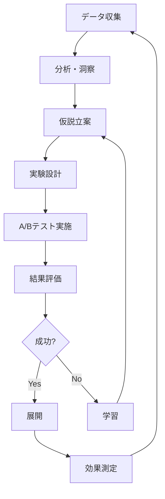

# 📊 プロダクトマネージャー向けドキュメント

> **注意**: このドキュメントは段階的に作成中です。多くのリンク先ファイルが **(準備中)** 状態です。

## 📋 概要

このセクションでは、フィーチャーフラグを活用した機能企画・戦略立案を行うプロダクトマネージャー向けの情報を提供します。

## 🎯 プロダクトマネージャーの責務

### 戦略立案
- ✅ 機能の段階的リリース戦略
- ✅ A/Bテスト計画・実施
- ✅ 市場投入タイミング調整
- ✅ リスク管理・軽減策定

### 効果測定
- ✅ KPI設定・追跡
- ✅ ユーザー行動分析
- ✅ ビジネス効果測定
- ✅ ROI計算・最適化

### ステークホルダー管理
- ✅ 開発チームとの連携
- ✅ ビジネス要件の調整
- ✅ 経営陣への報告
- ✅ ユーザーフィードバック収集

## 🚀 クイックスタート

### 💡 最初にやること
1. [フィーチャーフラグの価値理解](#価値理解)
2. [A/Bテスト戦略の立案](#ABテスト)
3. [効果測定指標の設定](#効果測定)
4. [リスク管理プロセスの確立](#リスク管理)

### 🎯 価値理解
```typescript
// フィーチャーフラグがもたらす価値
business_value: {
  // リスク軽減
  risk_reduction: {
    gradual_rollout: "段階的展開でリスクを最小化",
    instant_rollback: "問題発生時の即座の切り戻し",
    targeted_release: "特定ユーザーグループへの限定公開"
  },
  
  // 意思決定の改善
  better_decisions: {
    data_driven: "データに基づいた意思決定",
    ab_testing: "A/Bテストによる仮説検証",
    user_feedback: "リアルタイムなユーザー反応"
  },
  
  // 市場競争力
  competitive_advantage: {
    faster_release: "競合より早い市場投入",
    personalization: "ユーザー体験のパーソナライズ",
    innovation: "新しいアイデアの迅速な検証"
  }
}
```

## 📚 戦略ガイド

### 📖 基本戦略（推定時間: 3-4時間）
1. [フィーチャーフラグ戦略](./feature-flag-strategy.md)
2. [リリース戦略](./release-strategy.md)
3. [リスク管理](./risk-management.md)
4. [KPI設定](./kpi-setting.md)

### 🧪 実験戦略（推定時間: 4-5時間）
1. [A/Bテスト戦略](./ab-testing-strategy.md)
2. [実験設計](./experiment-design.md)
3. [仮説検証](./hypothesis-testing.md)
4. [結果分析](./result-analysis.md)

### 📊 効果測定（推定時間: 3-4時間）
1. [効果測定フレームワーク](./impact-measurement.md)
2. [ビジネス価値計算](./business-value-calculation.md)
3. [ROI分析](./roi-analysis.md)
4. [継続的改善](./continuous-improvement.md)

### 🎭 ユーザー体験（推定時間: 2-3時間）
1. [ユーザーセグメンテーション](./user-segmentation.md)
2. [パーソナライゼーション](./personalization.md)
3. [ユーザージャーニー最適化](./user-journey-optimization.md)
4. [フィードバック収集](./feedback-collection.md)

## 🧪 A/Bテスト戦略

### 📊 A/Bテスト計画
#### 実験設計テンプレート
```yaml
# A/Bテスト計画テンプレート
experiment_plan:
  name: "新しいダッシュボードのA/Bテスト"
  objective: "ユーザーエンゲージメントの向上"
  
  hypothesis:
    assumption: "新しいUIデザインにより、ユーザーの滞在時間が増加する"
    expected_impact: "平均滞在時間が20%増加"
    
  target_metrics:
    primary: "平均滞在時間"
    secondary: 
      - "ページビュー数"
      - "コンバージョン率"
      - "バウンス率"
      
  user_segments:
    - "新規ユーザー"
    - "リピーター"
    - "プレミアムユーザー"
    
  traffic_allocation:
    control: 50%
    treatment: 50%
    
  duration: "4週間"
  minimum_sample_size: 10000
  statistical_power: 80%
  significance_level: 5%
```

#### 実験実施フロー


### 📈 効果測定指標
#### KPI設定例
```typescript
// KPI設定例
kpi_framework: {
  // ユーザーエンゲージメント
  engagement: {
    daily_active_users: {
      baseline: 10000,
      target: 12000,
      improvement: "20%"
    },
    session_duration: {
      baseline: 5.2, // minutes
      target: 6.2,
      improvement: "19%"
    },
    pages_per_session: {
      baseline: 3.5,
      target: 4.2,
      improvement: "20%"
    }
  },
  
  // ビジネス指標
  business: {
    conversion_rate: {
      baseline: 2.5, // %
      target: 3.0,
      improvement: "20%"
    },
    revenue_per_user: {
      baseline: 50, // $
      target: 55,
      improvement: "10%"
    },
    churn_rate: {
      baseline: 5.0, // %
      target: 4.0,
      improvement: "20%"
    }
  },
  
  // 技術指標
  technical: {
    page_load_time: {
      baseline: 2.1, // seconds
      target: 1.8,
      improvement: "14%"
    },
    error_rate: {
      baseline: 0.5, // %
      target: 0.3,
      improvement: "40%"
    }
  }
}
```

## 🎯 リリース戦略

### 🚀 段階的リリース
#### リリース計画テンプレート
```yaml
# 段階的リリース計画
rollout_plan:
  feature_name: "新しいチェックアウトフロー"
  
  phases:
    - phase: "Phase 1 - 内部テスト"
      target_users: "社内ユーザー"
      percentage: 100
      duration: "1週間"
      success_criteria:
        - "エラー率 < 1%"
        - "パフォーマンス低下なし"
        
    - phase: "Phase 2 - Betaユーザー"
      target_users: "Betaプログラム参加者"
      percentage: 100
      duration: "2週間"
      success_criteria:
        - "ユーザー満足度 > 4.0"
        - "コンバージョン率向上"
        
    - phase: "Phase 3 - 限定公開"
      target_users: "プレミアムユーザー"
      percentage: 25
      duration: "2週間"
      success_criteria:
        - "技術的問題なし"
        - "ビジネス指標改善"
        
    - phase: "Phase 4 - 段階的展開"
      target_users: "全ユーザー"
      percentage: [10, 25, 50, 100]
      duration: "4週間"
      success_criteria:
        - "全指標で改善"
        - "ユーザーフィードバック良好"
```

### 📊 リスク管理
#### リスク評価マトリックス
```typescript
// リスク評価例
risk_assessment: {
  risks: [
    {
      risk: "新機能によるパフォーマンス低下",
      probability: "Medium",
      impact: "High",
      mitigation: "段階的展開とリアルタイム監視",
      owner: "技術チーム"
    },
    {
      risk: "ユーザー体験の悪化",
      probability: "Low",
      impact: "High",
      mitigation: "A/Bテストによる事前検証",
      owner: "UXチーム"
    },
    {
      risk: "コンバージョン率の低下",
      probability: "Medium",
      impact: "Critical",
      mitigation: "即座のロールバック機能",
      owner: "プロダクトチーム"
    }
  ],
  
  contingency_plans: {
    performance_degradation: "即座に10%にロールバック",
    negative_user_feedback: "フィードバック収集後24時間以内に判断",
    business_impact: "KPI悪化時は即座に停止"
  }
}
```

## 📊 ビジネス価値測定

### 💰 ROI計算
#### ROI計算フレームワーク
```typescript
// ROI計算例
roi_calculation: {
  // 投資コスト
  investment_costs: {
    development: 50000, // $
    testing: 10000,
    deployment: 5000,
    maintenance: 15000,
    total: 80000
  },
  
  // 効果・収益
  benefits: {
    // 直接効果
    direct_revenue_increase: 120000, // $
    cost_reduction: 30000,
    
    // 間接効果
    customer_satisfaction_improvement: 20000,
    time_to_market_improvement: 25000,
    
    total: 195000
  },
  
  // ROI計算
  roi: {
    net_benefit: 115000, // 195000 - 80000
    roi_percentage: 144, // (115000 / 80000) * 100
    payback_period: 4.9 // months
  }
}
```

### 📈 継続的改善
#### 改善サイクル


## 🎭 ユーザーセグメンテーション

### 👥 セグメント戦略
#### セグメント定義例
```typescript
// ユーザーセグメント例
user_segments: {
  demographic: {
    new_users: {
      definition: "登録から30日以内",
      size: 25000,
      characteristics: "機能学習中",
      strategy: "オンボーディング最適化"
    },
    power_users: {
      definition: "月間利用時間 > 10時間",
      size: 5000,
      characteristics: "高頻度利用",
      strategy: "高度機能提供"
    },
    at_risk_users: {
      definition: "30日間未利用",
      size: 15000,
      characteristics: "離脱リスク高",
      strategy: "リエンゲージメント"
    }
  },
  
  behavioral: {
    mobile_users: {
      definition: "モバイルアプリ利用",
      size: 40000,
      characteristics: "移動中利用",
      strategy: "モバイル最適化"
    },
    enterprise_users: {
      definition: "チーム機能利用",
      size: 8000,
      characteristics: "組織利用",
      strategy: "コラボレーション強化"
    }
  }
}
```

### 🎯 パーソナライゼーション戦略
```typescript
// パーソナライゼーション例
personalization_strategy: {
  content_personalization: {
    dashboard_layout: "ユーザー行動に基づくレイアウト最適化",
    feature_recommendations: "利用パターンに基づく機能提案",
    content_filtering: "関心に基づくコンテンツフィルタリング"
  },
  
  experience_personalization: {
    onboarding_flow: "ユーザータイプ別のオンボーディング",
    notification_timing: "最適なタイミングでの通知",
    pricing_display: "プラン推奨の最適化"
  }
}
```

## 📋 意思決定フレームワーク

### 🎯 意思決定マトリックス
```typescript
// 意思決定支援フレームワーク
decision_framework: {
  criteria: [
    {
      name: "ビジネス価値",
      weight: 40,
      scale: "1-10",
      description: "収益・成長への影響度"
    },
    {
      name: "ユーザー価値",
      weight: 30,
      scale: "1-10",
      description: "ユーザー満足度への影響"
    },
    {
      name: "技術実現性",
      weight: 20,
      scale: "1-10",
      description: "実装の難易度・リスク"
    },
    {
      name: "競合優位性",
      weight: 10,
      scale: "1-10",
      description: "差別化要因"
    }
  ],
  
  decision_process: [
    "データ収集・分析",
    "ステークホルダー意見収集",
    "評価基準での採点",
    "リスク・機会の評価",
    "意思決定・承認",
    "実行計画策定"
  ]
}
```

## 🔧 ツール・リソース

### 分析ツール
- [Google Analytics](https://analytics.google.com)
- [Mixpanel](https://mixpanel.com)
- [Amplitude](https://amplitude.com)
- [Hotjar](https://www.hotjar.com)

### A/Bテストツール
- [Optimizely](https://www.optimizely.com)
- [VWO](https://vwo.com)
- [Google Optimize](https://optimize.google.com)

### プロジェクト管理
- [Jira](https://www.atlassian.com/software/jira)
- [Asana](https://asana.com)
- [Notion](https://www.notion.so)

### 連絡先
- 開発チーム: dev-team@your-company.com
- データチーム: data-team@your-company.com
- マーケティングチーム: marketing@your-company.com

## 📚 学習リソース

### 🎓 トレーニング
- [プロダクトマネジメント基礎](./training/product-management-basics.md)
- [A/Bテスト実践](./training/ab-testing-practice.md)
- [データ分析手法](./training/data-analysis-methods.md)

### 📖 参考資料
- [プロダクト戦略ガイド](./guides/product-strategy.md)
- [A/Bテストベストプラクティス](./guides/ab-testing-best-practices.md)
- [効果測定手法](./guides/impact-measurement-methods.md)

---

## 🎯 成功指標

### 📊 プロダクトマネジメント指標
- **機能採用率**: 新機能の60%以上が目標採用率達成
- **A/Bテスト成功率**: 実施テストの30%以上で有意な改善
- **ROI**: 全プロジェクトでROI 150%以上
- **ユーザー満足度**: 平均4.5/5.0以上

### 📈 継続的改善
- 月次でのKPIレビュー
- 四半期での戦略見直し
- 年次でのプロダクトロードマップ更新

**次のステップ**: [A/Bテスト戦略](./ab-testing-strategy.md)から始めましょう！