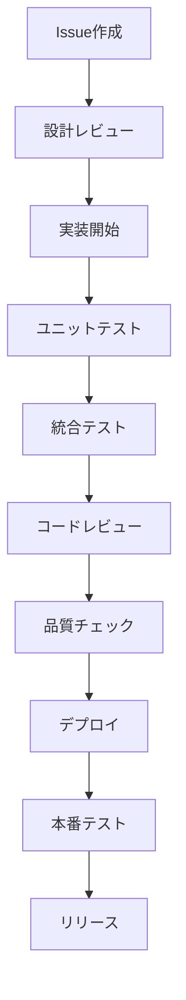

# 🔧 フィーチャーフラグシステム開発者向けドキュメント

## 📋 概要

このセクションでは、フィーチャーフラグシステム自体の開発・改良を行う開発者向けの情報を提供します。

## 🎯 システム開発者の責務

### 機能開発
- ✅ 新機能の設計・実装
- ✅ 既存機能の改良・最適化
- ✅ バグ修正・品質向上
- ✅ API設計・拡張

### アーキテクチャ
- ✅ システム設計・アーキテクチャ
- ✅ スケーラビリティ・可用性
- ✅ パフォーマンス最適化
- ✅ セキュリティ強化

### 開発基盤
- ✅ 開発環境の構築・改善
- ✅ テスト自動化・品質保証
- ✅ CI/CD パイプライン
- ✅ 開発ツールの整備

## 🚀 クイックスタート

### 💡 最初にやること
1. [開発環境の構築](#開発環境)
2. [アーキテクチャの理解](#アーキテクチャ)
3. [開発フローの確認](#開発フロー)
4. [テスト環境の確認](#テスト環境)

### 🔧 開発環境
```bash
# リポジトリのクローン
git clone https://github.com/your-org/feature-flag-system.git
cd feature-flag-system

# 依存関係のインストール
npm install

# 開発環境の起動
npm run dev

# テストの実行
npm test
```

## 🏗️ アーキテクチャ

### 📐 システム構成
```
┌─────────────────┐    ┌─────────────────┐    ┌─────────────────┐
│   Client Apps   │    │   Admin Panel   │    │   Monitoring    │
│                 │    │                 │    │                 │
│  - Web Apps     │    │  - Flag Mgmt    │    │  - Metrics      │
│  - Mobile Apps  │    │  - User Mgmt    │    │  - Alerts       │
│  - APIs         │    │  - Analytics    │    │  - Dashboards   │
└─────────┬───────┘    └─────────┬───────┘    └─────────┬───────┘
          │                      │                      │
          └──────────────────────┼──────────────────────┘
                                 │
                    ┌─────────────┴─────────────┐
                    │      Load Balancer       │
                    └─────────────┬─────────────┘
                                  │
                    ┌─────────────┴─────────────┐
                    │      API Gateway         │
                    └─────────────┬─────────────┘
                                  │
          ┌───────────────────────┼───────────────────────┐
          │                       │                       │
┌─────────┴───────┐    ┌─────────┴───────┐    ┌─────────┴───────┐
│   Flag Service  │    │  Admin Service  │    │ Analytics Service│
│                 │    │                 │    │                 │
│ - Evaluation    │    │ - CRUD Ops      │    │ - Metrics       │
│ - Caching       │    │ - User Auth     │    │ - Reporting     │
│ - Validation    │    │ - Audit Logs    │    │ - ML/AI         │
└─────────┬───────┘    └─────────┬───────┘    └─────────┬───────┘
          │                      │                      │
          └──────────────────────┼──────────────────────┘
                                 │
                    ┌─────────────┴─────────────┐
                    │      Database            │
                    │                          │
                    │ - PostgreSQL/MySQL       │
                    │ - Redis (Cache)          │
                    │ - InfluxDB (Metrics)     │
                    └──────────────────────────┘
```

### 🔧 技術スタック
```typescript
// フロントエンド
frontend: {
  framework: 'React 18',
  language: 'TypeScript',
  styling: 'Tailwind CSS',
  state_management: 'Redux Toolkit',
  testing: 'Jest + React Testing Library'
}

// バックエンド
backend: {
  runtime: 'Node.js 18',
  framework: 'Express.js',
  language: 'TypeScript',
  database: 'PostgreSQL',
  cache: 'Redis',
  testing: 'Jest + Supertest'
}

// インフラ
infrastructure: {
  containerization: 'Docker',
  orchestration: 'Kubernetes',
  cloud: 'AWS/GCP/Azure',
  monitoring: 'Prometheus + Grafana',
  logging: 'ELK Stack'
}
```

## 📚 開発ガイド

### 📖 基礎知識（推定時間: 4-6時間）
1. [アーキテクチャ設計](./architecture.md)
2. [データモデル](./data-model.md)
3. [API設計原則](./api-design.md)
4. [開発規約](./development-conventions.md)

### 🔨 開発環境（推定時間: 2-3時間）
1. [開発環境構築](./development-setup.md)
2. [デバッグ方法](./debugging.md)
3. [テスト環境](./testing-environment.md)
4. [開発ツール](./development-tools.md)

### 🏗️ 実装ガイド（推定時間: 8-12時間）
1. [新機能の実装](./feature-implementation.md)
2. [API拡張](./api-extension.md)
3. [データベース設計](./database-design.md)
4. [パフォーマンス最適化](./performance-optimization.md)

### 🧪 テスト戦略（推定時間: 4-6時間）
1. [テスト戦略](./testing-strategy.md)
2. [ユニットテスト](./unit-testing.md)
3. [統合テスト](./integration-testing.md)
4. [パフォーマンステスト](./performance-testing.md)

## 🔧 コア機能の実装

### 🚀 フラグ評価エンジン
```typescript
// フラグ評価の核となるロジック
export class FlagEvaluator {
  async evaluate(
    flagKey: string, 
    context: EvaluationContext
  ): Promise<EvaluationResult> {
    // 1. フラグの取得
    const flag = await this.flagRepository.getFlag(flagKey);
    if (!flag) {
      return this.getDefaultResult(flagKey);
    }

    // 2. 対象判定
    const isTargeted = await this.targetingEngine.isTargeted(flag, context);
    if (!isTargeted) {
      return this.getDefaultResult(flagKey);
    }

    // 3. バリエーション選択
    const variation = await this.variationSelector.select(flag, context);
    
    // 4. 結果の記録
    await this.recordEvaluation(flagKey, context, variation);

    return {
      flagKey,
      value: variation.value,
      variationKey: variation.key,
      reason: 'TARGETED'
    };
  }
}
```

### 🎯 ターゲティングエンジン
```typescript
// ユーザー・テナント・条件に基づくターゲティング
export class TargetingEngine {
  async isTargeted(
    flag: FeatureFlag, 
    context: EvaluationContext
  ): Promise<boolean> {
    // 1. 基本的なフィルタリング
    if (!this.matchesEnvironment(flag, context)) {
      return false;
    }

    // 2. ユーザー属性での絞り込み
    if (!this.matchesUserAttributes(flag, context)) {
      return false;
    }

    // 3. セグメント条件の確認
    if (!await this.matchesSegments(flag, context)) {
      return false;
    }

    // 4. パーセンテージロールアウト
    if (!this.matchesPercentageRollout(flag, context)) {
      return false;
    }

    return true;
  }

  private matchesUserAttributes(
    flag: FeatureFlag, 
    context: EvaluationContext
  ): boolean {
    return flag.targeting.userAttributes.every(attr => 
      this.evaluateCondition(attr, context)
    );
  }

  private evaluateCondition(
    condition: AttributeCondition, 
    context: EvaluationContext
  ): boolean {
    const value = context.getAttribute(condition.attribute);
    
    switch (condition.operator) {
      case 'equals':
        return value === condition.value;
      case 'in':
        return condition.values.includes(value);
      case 'contains':
        return value.includes(condition.value);
      case 'regex':
        return new RegExp(condition.value).test(value);
      default:
        return false;
    }
  }
}
```

### 📊 メトリクスコレクター
```typescript
// メトリクス収集と分析
export class MetricsCollector {
  async recordEvaluation(
    flagKey: string,
    context: EvaluationContext,
    result: EvaluationResult
  ): Promise<void> {
    const metrics = {
      timestamp: Date.now(),
      flagKey,
      userId: context.userId,
      tenantId: context.tenantId,
      environment: context.environment,
      variation: result.variationKey,
      reason: result.reason,
      responseTime: result.responseTime,
      cached: result.cached
    };

    // 1. リアルタイム用のメトリクス
    await this.publishToStream(metrics);

    // 2. 分析用のバッチ処理
    await this.queueForBatch(metrics);

    // 3. アラート判定
    await this.checkAlerts(metrics);
  }

  async generateReport(
    flagKey: string,
    timeRange: TimeRange
  ): Promise<FlagReport> {
    const evaluations = await this.queryEvaluations(flagKey, timeRange);
    
    return {
      flagKey,
      timeRange,
      totalEvaluations: evaluations.length,
      uniqueUsers: new Set(evaluations.map(e => e.userId)).size,
      variationDistribution: this.calculateDistribution(evaluations),
      performanceMetrics: this.calculatePerformance(evaluations),
      trends: this.calculateTrends(evaluations)
    };
  }
}
```

## 🔄 開発フロー

### 📋 開発プロセス


### 🔧 ブランチ戦略
```bash
# ブランチ構成
main          # 本番環境
├── develop   # 開発環境
├── staging   # ステージング環境
└── features  # 機能開発
    ├── feature/new-targeting-engine
    ├── feature/metrics-improvement
    └── feature/api-v2
```

### 📝 コミット規約
```bash
# コミットメッセージ形式
<type>(<scope>): <description>

[optional body]

[optional footer]

# 例
feat(api): add new targeting engine
fix(ui): resolve button alignment issue
docs(readme): update installation guide
test(e2e): add evaluation performance tests
```

## 🧪 テスト戦略

### 📊 テストピラミッド
```
         ┌─────────────────┐
         │   E2E Tests     │ <- 少数、高価値
         │   (10-15%)      │
         ├─────────────────┤
         │ Integration     │ <- 適度、API/DB
         │ Tests (20-30%)  │
         ├─────────────────┤
         │  Unit Tests     │ <- 多数、高速
         │  (60-70%)       │
         └─────────────────┘
```

### 🔧 テスト種別
```typescript
// ユニットテスト
describe('FlagEvaluator', () => {
  it('should return default when flag not found', async () => {
    const evaluator = new FlagEvaluator(mockRepo);
    const result = await evaluator.evaluate('nonexistent', context);
    expect(result.reason).toBe('FLAG_NOT_FOUND');
  });
});

// 統合テスト
describe('Flag API', () => {
  it('should evaluate flag correctly', async () => {
    const response = await request(app)
      .post('/api/evaluate')
      .send({ flagKey: 'test-flag', context })
      .expect(200);
    
    expect(response.body.enabled).toBe(true);
  });
});

// E2Eテスト
describe('Flag Management Flow', () => {
  it('should create, enable, and evaluate flag', async () => {
    await createFlag('new-feature');
    await enableFlag('new-feature');
    const result = await evaluateFlag('new-feature', context);
    expect(result.enabled).toBe(true);
  });
});
```

## 🚀 デプロイメント

### 📦 CI/CD パイプライン
```yaml
# .github/workflows/ci.yml
name: CI/CD Pipeline

on:
  push:
    branches: [main, develop]
  pull_request:
    branches: [main]

jobs:
  test:
    runs-on: ubuntu-latest
    steps:
      - uses: actions/checkout@v3
      - uses: actions/setup-node@v3
        with:
          node-version: '18'
      - run: npm ci
      - run: npm run test
      - run: npm run test:e2e
      - run: npm run build

  deploy:
    needs: test
    runs-on: ubuntu-latest
    if: github.ref == 'refs/heads/main'
    steps:
      - run: npm run deploy:production
```

### 🐳 Docker設定
```dockerfile
# Dockerfile
FROM node:18-alpine

WORKDIR /app

COPY package*.json ./
RUN npm ci --only=production

COPY . .
RUN npm run build

EXPOSE 3000

CMD ["npm", "start"]
```

### ☸️ Kubernetes設定
```yaml
# k8s/deployment.yaml
apiVersion: apps/v1
kind: Deployment
metadata:
  name: feature-flag-api
spec:
  replicas: 3
  selector:
    matchLabels:
      app: feature-flag-api
  template:
    metadata:
      labels:
        app: feature-flag-api
    spec:
      containers:
      - name: api
        image: feature-flag-api:latest
        ports:
        - containerPort: 3000
        env:
        - name: NODE_ENV
          value: "production"
        - name: DATABASE_URL
          valueFrom:
            secretKeyRef:
              name: db-secret
              key: url
```

## 📊 監視・観測

### 📈 メトリクス
```typescript
// 監視すべきメトリクス
const metrics = {
  // API メトリクス
  api: {
    requests_per_second: 1000,
    response_time_p95: 150,
    error_rate: 0.01
  },
  
  // ビジネス メトリクス
  business: {
    flag_evaluations_per_day: 10000000,
    active_flags: 250,
    active_users: 50000
  },
  
  // インフラ メトリクス
  infrastructure: {
    cpu_usage: 45,
    memory_usage: 60,
    disk_usage: 30
  }
};
```

### 🔍 ログ設定
```typescript
// ログ設定
const logger = winston.createLogger({
  level: 'info',
  format: winston.format.combine(
    winston.format.timestamp(),
    winston.format.json()
  ),
  transports: [
    new winston.transports.File({ filename: 'app.log' }),
    new winston.transports.Console()
  ]
});

// 構造化ログ
logger.info('Flag evaluated', {
  flagKey: 'new-feature',
  userId: 'user-123',
  result: true,
  responseTime: 25,
  cached: false
});
```

## 🔐 セキュリティ

### 🛡️ セキュリティ考慮事項
```typescript
// 認証・認可
export class AuthMiddleware {
  async authenticate(req: Request, res: Response, next: NextFunction) {
    try {
      const token = req.headers.authorization?.split(' ')[1];
      const decoded = jwt.verify(token, process.env.JWT_SECRET);
      req.user = decoded;
      next();
    } catch (error) {
      res.status(401).json({ error: 'Unauthorized' });
    }
  }

  authorize(permissions: string[]) {
    return (req: Request, res: Response, next: NextFunction) => {
      if (!req.user.permissions.some(p => permissions.includes(p))) {
        return res.status(403).json({ error: 'Forbidden' });
      }
      next();
    };
  }
}

// 入力検証
export class ValidationMiddleware {
  validateFlagKey(req: Request, res: Response, next: NextFunction) {
    const { flagKey } = req.params;
    if (!/^[a-zA-Z0-9-_]+$/.test(flagKey)) {
      return res.status(400).json({ error: 'Invalid flag key' });
    }
    next();
  }
}
```

## 🔧 拡張ポイント

### 🔌 プラグインシステム
```typescript
// プラグインインターフェース
export interface Plugin {
  name: string;
  version: string;
  
  onFlagEvaluated?(event: EvaluationEvent): Promise<void>;
  onFlagCreated?(event: FlagCreatedEvent): Promise<void>;
  onFlagUpdated?(event: FlagUpdatedEvent): Promise<void>;
}

// カスタムプラグインの例
export class SlackNotificationPlugin implements Plugin {
  name = 'slack-notification';
  version = '1.0.0';

  async onFlagCreated(event: FlagCreatedEvent): Promise<void> {
    await this.sendSlackMessage(
      `New flag created: ${event.flagKey}`
    );
  }

  async onFlagUpdated(event: FlagUpdatedEvent): Promise<void> {
    await this.sendSlackMessage(
      `Flag updated: ${event.flagKey} - ${event.changes}`
    );
  }
}
```

### 🔄 カスタムターゲティング
```typescript
// カスタムターゲティングルール
export interface TargetingRule {
  name: string;
  evaluate(context: EvaluationContext): Promise<boolean>;
}

// 時間ベースのターゲティング
export class TimeBasedTargeting implements TargetingRule {
  name = 'time-based';

  async evaluate(context: EvaluationContext): Promise<boolean> {
    const now = new Date();
    const hour = now.getHours();
    
    // 営業時間中のみ有効
    return hour >= 9 && hour <= 17;
  }
}

// 地理的ターゲティング
export class GeoTargeting implements TargetingRule {
  name = 'geo-based';

  async evaluate(context: EvaluationContext): Promise<boolean> {
    const userCountry = context.getAttribute('country');
    const allowedCountries = ['US', 'CA', 'GB'];
    
    return allowedCountries.includes(userCountry);
  }
}
```

## 📚 参考資料

### 📖 技術文書
- [API仕様書](./api-specification.md)
- [データベース設計](./database-design.md)
- [アーキテクチャ図](./architecture-diagrams.md)
- [セキュリティガイド](./security-guide.md)

### 🛠️ 開発ツール
- [開発環境構築](./development-setup.md)
- [デバッグガイド](./debugging-guide.md)
- [テストツール](./testing-tools.md)
- [監視ツール](./monitoring-tools.md)

### 🤝 コミュニティ
- [コントリビューションガイド](./contributing.md)
- [コードレビューガイド](./code-review.md)
- [イシュートリアージ](./issue-triage.md)

---

## 🎯 開発の成功指標

### 📊 品質指標
- **テストカバレッジ**: 90% 以上
- **コードレビュー**: 100% 実施
- **静的解析**: 0 件の重大な問題
- **脆弱性**: 0 件の高リスク

### 🚀 パフォーマンス指標
- **ビルド時間**: 5分以内
- **デプロイ時間**: 10分以内
- **テスト実行時間**: 15分以内

**次のステップ**: [開発環境構築](./development-setup.md)から始めましょう！